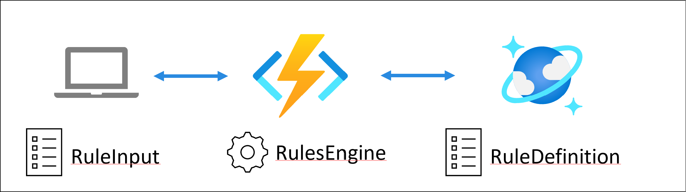

# Introduction

This repository contains a sample Azure Functions application for [RulesEngine](https://github.com/microsoft/RulesEngine). The rule definitions are stored in Cosmos DB. This branch uses polling model to get latest change from Cosmos DB.

## What is RulesEngine

You can use RulesEngine to compare input data against pre-defined rules, both defined by using JSON format, to identify if the input data meet the rule or not. It supports complex rules definition by supporting hierarchy and lambda expressin in C# to compare data. 

## Why you may want to host it on Azure Function?

RulesEngine is provided as NuGet packages which you can include in your project. In cloud native world, its common to separate services into microservices which responsible on particular tasks. Typically, these services provide endpoint which other services can call-in. 

Azure Function is great choice to host a service as webservice which is responsibile this purpose. You can host Azure Functions in Azure Subscription, or you can deploy it to kubernates. See [Azure Functions on Kubernetes with KEAD](https://docs.microsoft.com/en-us/azure/azure-functions/functions-kubernetes-keda) for more detail.

## Why you may want to store rules definition in Cosmos DB

Actually, you can host rules definition anywhere, even local to the Azure Function. It's depends on:

- how many rules you have
- how frequent you update them
- how fast the rules have to be reflected

Azure Functions has native Cosmos DB binding for trigger/innput/output which is good match for managing and updating rules definitions.

# Architecture



- Client sends input data as JSON
- Azure Function host RulesEngine and process input data
- Rules definitions are stored in Cosmos DB
- Use Polling to Cosmos DB to get any change of rules and sync to Azure Functions

# Required Azure Service

- Azure Functions
- Cosmos DB (Core API)

## Cosmos DB containers

- This sample expects "rulesDb" database and "rulesEngineWorkflows" and "leases" container with "/id" as partition.
- leases container is used for [Cosmos DB ChangeFeed](https://docs.microsoft.com/en-us/azure/cosmos-db/change-feed).

# Reading Rule Definitions

1. When the function app started, it reads all rule definitions from CosmosDB in startup and store them in memory.

1. Then it uses timer tigger to periodically checks if there is any change since last check. When it finds any change, then the function updates rules in memory.

You can change polling interval by change TimerTrigger attribute in RulesEngineOnFunction.cs. You can also make it configurable. See [Timer trigger for Azure Functions](https://docs.microsoft.com/en-us/azure/azure-functions/functions-bindings-timer) for more detail.

# Example rule definition

Example of rule definition in Cosmos DB. Please compare with [Discount.json in original repo](https://github.com/microsoft/RulesEngine/blob/main/demo/DemoApp/Workflows/Discount.json)

```json
{
    "id": "Discount",
    "rule": {
        "workflowName": "Discount",
        "rules": [
            {
                "ruleName": "GiveDiscount10",
                "successEvent": "10",
                "errorMessage": "One or more adjust rules failed.",
                "errorType": "Error",
                "ruleExpressionType": "Lambdaexpression",
                "expression": "input1.country == \"india\" AND input1.loyalityFactor <= 2 AND input1.totalPurchasesToDate >= 5000 AND input2.totalOrders > 2 AND input3.noOfVisitsPerMonth > 2"
            },
            {
                "ruleName": "GiveDiscount20",
                "successEvent": "20",
                "errorMessage": "One or more adjust rules failed.",
                "errorType": "Error",
                "ruleExpressionType": "Lambdaexpression",
                "expression": "input1.country == \"india\" AND input1.loyalityFactor == 3 AND input1.totalPurchasesToDate >= 10000 AND input2.totalOrders > 2 AND input3.noOfVisitsPerMonth > 2"
            },
            {
                "ruleName": "GiveDiscount25",
                "successEvent": "25",
                "errorMessage": "One or more adjust rules failed.",
                "errorType": "Error",
                "ruleExpressionType": "Lambdaexpression",
                "expression": "input1.country != \"india\" AND input1.loyalityFactor >= 4 AND input1.totalPurchasesToDate >= 10000 AND input2.totalOrders > 2 AND input3.noOfVisitsPerMonth > 5"
            },
            {
                "ruleName": "GiveDiscount30",
                "successEvent": "30",
                "errorMessage": "One or more adjust rules failed.",
                "errorType": "Error",
                "ruleExpressionType": "Lambdaexpression",
                "expression": "input1.loyalityFactor > 3 AND input1.totalPurchasesToDate >= 50000 AND input1.totalPurchasesToDate <= 100000 AND input2.totalOrders > 5 AND input3.noOfVisitsPerMonth > 15"
            },
            {
                "ruleName": "GiveDiscount30NestedOrExample",
                "successEvent": "30",
                "errorMessage": "One or more adjust rules failed.",
                "errorType": "Error",
                "operator": "OrElse",
                "rules": [
                    {
                        "ruleName": "IsLoyalAndHasGoodSpend",
                        "errorMessage": "One or more adjust rules failed.",
                        "errorType": "Error",
                        "ruleExpressionType": "Lambdaexpression",
                        "expression": "input1.loyalityFactor > 3 AND input1.totalPurchasesToDate >= 50000 AND input1.totalPurchasesToDate <= 100000"
                    },
                    {
                        "ruleName": "OrHasHighNumberOfTotalOrders",
                        "errorMessage": "One or more adjust rules failed.",
                        "errorType": "Error",
                        "ruleExpressionType": "Lambdaexpression",
                        "expression": "input2.totalOrders > 15"
                    }
                ]
            },
            {
                "ruleName": "GiveDiscount35NestedAndExample",
                "successEvent": "35",
                "errorMessage": "One or more adjust rules failed.",
                "errorType": "Error",
                "operator": "AndAlso",
                "rules": [
                    {
                        "ruleName": "IsLoyal",
                        "errorMessage": "One or more adjust rules failed.",
                        "errorType": "Error",
                        "ruleExpressionType": "Lambdaexpression",
                        "expression": "input1.loyalityFactor > 3"
                    },
                    {
                        "ruleName": "AndHasTotalPurchased100000",
                        "errorMessage": "One or more adjust rules failed.",
                        "errorType": "Error",
                        "ruleExpressionType": "Lambdaexpression",
                        "expression": "input1.totalPurchasesToDate >= 100000"
                    },
                    {
                        "ruleName": "AndOtherConditions",
                        "errorMessage": "One or more adjust rules failed.",
                        "errorType": "Error",
                        "ruleExpressionType": "Lambdaexpression",
                        "expression": "input2.totalOrders > 15 AND input3.noOfVisitsPerMonth > 25"
                    }
                ]
            }
        ]
    }
}
```

## Change Feed

Cosmos DB Change Feed gives changed content with Change Feed notification, thus we usually don't need to query the database to get latest document. However, only one instance of Azure Functions receives the notification when it scaled-out, therefore you may encounter rules in memory inconsistency between functions. That's why this branch uses polling strategy so that each instance independently poll Cosmos DB to get latest changes.

It depends on how frequent it polls, you still have some time window when each function instances may contain different set up rules.

- If you only run single instance and want to use Cosmos DB ChangeFeed binding, see the main branch of this repository.
- If you are looking for more real-time synchronization between Azure Function instances, see [Distributed in-memory cache using Azure Functions Sample](https://github.com/hannesne/functions-cache-sample) as starting point.

# How to run in local

Once you provision Cosmos DB and create rules, you can try the function in local (or on Azure).
1. Create local.settings.json and add following config.
1. Update CosmosDBConnectionString.

    ```json
    {
    "Values": {
        "AzureWebJobsStorage": "UseDevelopmentStorage=true",
        "FUNCTIONS_WORKER_RUNTIME": "dotnet-isolated",
        "CosmosDBConnectionString": "",
        "DatabaseId": "rulesDb",
        "ContainerId": "rulesEngineWorkflows"
    },
    "Host": {
        "LocalHttpPort": 7071,
        "CORS": "*",
        "CORSCredentials": false
    },
    "IsEncrypted": false
    }
    ```
1. Run the function in RulesEngineOnFunction folder.
    ```shell
    func start
    ```
1. Use any tool to send Post message to endpoint. This sample expect data format defined in [InputRule.cs](./RulesEngineOnFunction/Models/InputRule.cs)

    POST:  http://localhost:7071/api/ExecuteRule
    Body:
    ```json
    {
        "workflowName": "Discount",
        "basicInfo": {
            "name": "hello",
            "email": "abcy@xyz.com",
            "creditHistory": "good",
            "country": "canada",
            "loyalityFactor": 3,
            "totalPurchasesToDate": 10000
        },
        "orderInfo": {
            "totalOrders": 5,
            "recurringItems": 2
        },
        "telemetryInfo": {
            "noOfVisitsPerMonth": 10,
            "percentageOfBuyingToVisit": 15
        }
    }
    ```
1. Change input data or rules in Cosmos DB to see if you can get different results.

1. If you want to try multiple instances test, you can copy the code and run it by specifying different ports.

    ```shell
    func start --port <port number>
    ```

# Feedback

Please feel free to give us feedback from issues.